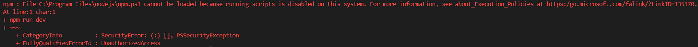
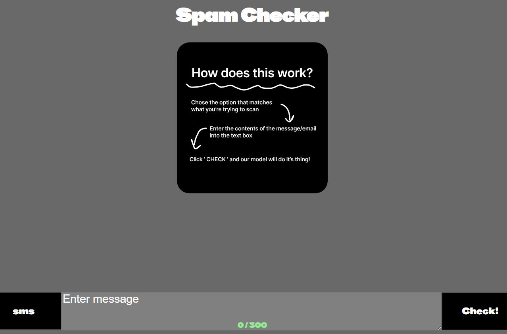

# Instructions for Using this Codebase:
A collection of machine learning models for classifying spam in SMS messages and emails.

**Authors**
*Denver Cope,*
*Douglas Massey,*
*and Isath De Silva*

# Libraries Required:
`pandas`
`scikit-learn`
`numpy` 
`joblib` 
`matplot` 
`seaborn` 
`tensorflow`
`Node.js` 
`npm`  
`FastAPI`

This repo contains the .pkl files for each model already.
If they are missing, run the following program:

* LR_SMS.py
* SVM_email.py
* GRUTrainSpam.ipynb
* NaiveBayesTrain.ipynb

# To Query the Models:

Run CLASSIFY.py from the terminal inside the project directory:

`python CLASSIFY.py <model> <input string to query>`

# Accepted Inputs for Model Choice:

* `LR`- *Logistic Regression (SMS)*
* `SVM` - *Linear Vector Classifier (EMAIL)*
* `NBSMS` - *Naive Bayes(SMS)*
* `NBE` - *Naive Bayes for (EMAIL)*
* `GRU` - *Gated Recurrent Unit (EMAIL)*
* `ALLE` - *All Email Models*
* `ALLSMS` - *All SMS Models*

here's an example which uses the Naive Bayes email clasification model:

`python CLASSIFY.py NBE "Subject: brighten those teeth  get your  teeth bright white now !  have you considered professional teeth whitening ? if so , you  know it usually costs between $ 300 and $ 500 from your local  dentist !"`

# **Web-Based Application Initalization** 

First to begin the FastAPI run the following code in your terminal:  
`python -m uvicorn TestAPI:app --reload` 

Once the initalization has succeeded, open a second terminal 

in this second terminal navigate to the vue-project folder with the command 
`cd vue-project` 

*this assumes you are already within the CTIP-ASSIGNMENT-2 directory*

once in the directory run the command: 
`npm run dev`

*IF you recieve an error that running scripts is disabled*

*run the command*
`Set-ExecutionPolicy -Scope Process -ExecutionPolicy Bypass`

*this will allow scripts for ONLY the current powershell session, then retry the npm command above* 

After the initalization head to the link provided in the terminal 
*it should look like* 
`http://localhost:5173` 

This will allow you to interact with the model classification from a userfriendly interface

Follow the onscreen guide for how to interact with the website!
